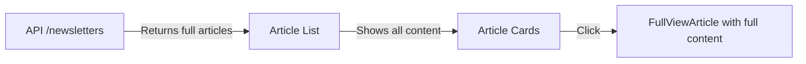

# Lazy Loading Implementation Plan

## Overview

This document outlines the plan to implement lazy loading of article content to improve performance and reduce bandwidth usage. The key idea is to only load full article content when needed (when a user clicks to read an article) rather than loading all content upfront.

## Current Redis Schema

```typescript
// Current Structure
{
  // List of all newsletter IDs
  "newsletter_ids": ["id1", "id2", ...],
  
  // Individual newsletter data
  "newsletter:id1": {
    id: string,
    subject: string,
    content: string,  // Full content
    publishDate: string,
    sender: string,
    // ... other fields
  }
}
```

## Current Architecture



## Proposed Architecture

```mermaid
graph LR
    A[API /newsletters] -->|Returns summaries| B[Article List]
    B -->|Shows summaries| C[Article Cards]
    C -->|Click| D[API /articles/{id}/content]
    D -->|Returns full content| E[FullViewArticle]
```

## Data Model Changes

### Current

```typescript
interface Article {
  id: string;
  subject: string;
  sender: string;
  date: string;
  content: string;      // Full content always included
  // ... other fields
}
```

### New

```typescript
interface ArticleSummary {
  id: string;
  subject: string;
  sender: string;
  date: string;
  summary: string;      // Short preview (200-300 chars)
  hasFullContent: boolean;
  // ... other metadata fields
}

interface ArticleContent {
  id: string;
  content: string;      // Full HTML content
  // ... other content-specific fields
}
```

## API Endpoints

### 1. Get Article List (Updated)

**Endpoint:** `GET /api/newsletters`
**Response:**

```typescript
{
  articles: ArticleSummary[];
  // ... pagination and other metadata
}
```

### 2. Get Article Content (New)

**Endpoint:** `GET /api/articles/:id/content`
**Response:**

```typescript
{
  content: string;  // Full HTML content
  processedAt: string;
  // ... other metadata
}
```

## Implementation Phases

### Phase 0: Non-Breaking Schema Migration

1. **Dual-Write Strategy**:
   - New writes go to both old and new schemas
   - Existing data remains accessible via old schema
   - New endpoints use the new schema

2. **New Redis Schema**:

   ```typescript
   // New structure (alongside existing)
   "newsletter:meta:id1": {  // New key pattern
     id: string,
     subject: string,
     summary: string,
     publishDate: string,
     sender: string,
     hasFullContent: boolean,
     // ... other metadata
   }
   
   "newsletter:content:id1": {  // New key pattern
     content: string,
     processedAt: string
   }
   ```

3. **Migration Script**:

   ```typescript
   // scripts/migrate-newsletters.ts
   const ids = await redis.lrange('newsletter_ids', 0, -1);
   for (const id of ids) {
     const oldData = await redis.get(`newsletter:${id}`);
     if (oldData) {
       const article = JSON.parse(oldData);
       await redis.hset(`newsletter:meta:${id}`, {
         id: article.id,
         subject: article.subject,
         summary: generateSummary(article.content),
         publishDate: article.publishDate,
         sender: article.sender,
         hasFullContent: true
       });
       await redis.set(`newsletter:content:${id}`, article.content);
     }
   }
   ```

### Phase 1: Backend Changes

#### 1.1 Content Summarization Utility

```typescript
// utils/contentUtils.ts
export function generateSummary(content: string, maxLength = 200): string {
  const plainText = DOMPurify.sanitize(content, { ALLOWED_TAGS: [] });
  return plainText.length > maxLength 
    ? plainText.substring(0, maxLength) + '...' 
    : plainText;
}
```

#### 1.2 Update Storage Layer

```typescript
// lib/storage.ts
class ArticleStorage {
  async storeArticle(article: Article) {
    const summary = generateSummary(article.content);
    await redis.hset(`article:${article.id}`, {
      ...article,
      summary,
      hasFullContent: true
    });
  }

  async getArticleSummary(id: string): Promise<ArticleSummary> {
    const data = await redis.hgetall(`article:${id}`);
    return {
      id: data.id,
      subject: data.subject,
      sender: data.sender,
      date: data.date,
      summary: data.summary,
      hasFullContent: Boolean(data.hasFullContent)
    };
  }

  async getArticleContent(id: string): Promise<string> {
    const data = await redis.hgetall(`article:${id}`);
    return data.content;
  }
}
```

### Phase 2: Frontend Changes

#### 2.1 Update ArticleGridCard

```tsx
// components/newsletter/ArticleGridCard.tsx
interface ArticleGridCardProps {
  id: string;
  summary: string;
  // ... other props
  onExpand: (articleId: string) => void;
}

export function ArticleGridCard({ id, summary, onExpand }: ArticleGridCardProps) {
  return (
    <Card onClick={() => onExpand(id)}>
      <CardContent>
        <p className="line-clamp-3">{summary}</p>
      </CardContent>
    </Card>
  );
}
```

#### 2.2 Update FullViewArticle

```tsx
// components/article/FullViewArticle.tsx
interface FullViewArticleProps {
  articleId: string;
  initialData?: ArticleSummary;
  onClose: () => void;
}

export function FullViewArticle({ articleId, initialData, onClose }: FullViewArticleProps) {
  const [content, setContent] = useState<string | null>(null);
  const [isLoading, setIsLoading] = useState(false);
  const [error, setError] = useState<Error | null>(null);

  useEffect(() => {
    const loadContent = async () => {
      if (content) return;
      
      setIsLoading(true);
      setError(null);
      
      try {
        const response = await fetch(`/api/articles/${articleId}/content`);
        if (!response.ok) throw new Error('Failed to load content');
        const data = await response.json();
        setContent(data.content);
      } catch (err) {
        setError(err instanceof Error ? err : new Error('Unknown error'));
      } finally {
        setIsLoading(false);
      }
    };

    loadContent();
  }, [articleId, content]);

  return (
    <Modal onClose={onClose}>
      {isLoading && <LoadingSpinner />}
      {error && <ErrorMessage error={error} />}
      {content && <ArticleContent content={content} />}
      {!content && !isLoading && !error && initialData?.summary && (
        <ArticleContent content={initialData.summary} />
      )}
    </Modal>
  );
}
```

### Phase 3: Data Migration

1. Create a migration script to generate summaries for existing articles
2. Update Redis schema to include the new fields
3. Backfill existing data

```typescript
// scripts/migrate-articles.ts
async function migrateArticles() {
  const keys = await redis.keys('article:*');
  
  for (const key of keys) {
    const article = await redis.hgetall(key);
    if (!article.summary && article.content) {
      const summary = generateSummary(article.content);
      await redis.hset(key, { summary, hasFullContent: true });
    }
  }
}
```

## Performance Benefits

1. **Reduced Initial Payload**:
   - Before: 100 articles × ~50KB = ~5MB
   - After: 100 articles × ~2KB = ~200KB
   - **Savings: ~96% reduction**

2. **Faster Time to Interactive**: Pages load faster with smaller payloads
3. **Reduced Server Load**: Less data transferred per request
4. **Better Mobile Experience**: Lower bandwidth usage for mobile users
5. **Improved Cache Efficiency**: Smaller payloads increase cache hit rates
6. **Progressive Enhancement**: Users see content faster while full content loads

## Potential Issues and Mitigations

1. **Content Flash When Loading**
   - Mitigation: Show skeleton loaders during content fetch
   - Strategy: Use React Suspense with fallback UI

2. **API Latency**
   - Mitigation: Implement client-side caching with stale-while-revalidate
   - Strategy: Use SWR or React Query with appropriate cache TTLs
   - Implementation:

     ```typescript
     // lib/cache.ts
     const CACHE_NAME = 'newsletter-cache-v1';
     
     async function cacheArticle(article) {
       const cache = await caches.open(CACHE_NAME);
       await cache.put(
         `/api/articles/${article.id}/content`,
         new Response(JSON.stringify(article.content))
       );
     }
     ```

3. **Backward Compatibility**
   - Mitigation: Dual-write during migration period
   - Strategy: Keep old endpoints until all clients are updated
   - Monitoring: Track usage of old vs new endpoints

4. **Cache Invalidation**
   - Strategy: Use content hashes or versioning
   - Implementation: Include `ETag` or `Last-Modified` headers

5. **Offline Support**
   - Strategy: Service Worker caching for content
   - Fallback: Show cached content with offline indicator

## Next Steps

1. Implement Phase 1 (Backend Changes)
2. Update Frontend Components
3. Create Migration Scripts
4. Test Performance Impact
5. Deploy in Stages
6. Monitor and Optimize

## Monitoring

For detailed metrics and monitoring implementation, see [Metrics Implementation Plan](./metrics_implementation_plan.md).

Key metrics to track for lazy loading:

- Content load times
- Cache hit/miss rates
- Error rates for content loading
- Storage usage and eviction metrics
