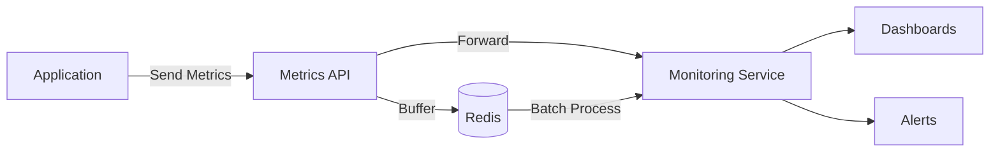

# Metrics and Monitoring Implementation Plan

## 1. Overview

This document outlines the implementation of a comprehensive metrics and monitoring system for the newsletter application. The system will track application performance, reliability, and business metrics.

## 2. Architecture

### 2.1 High-Level Design



### 2.2 Component Responsibilities

- **Metrics API**: Receive, validate, and process metrics
- **Redis Buffer**: Temporary storage for batching and reliability
- **Monitoring Service**: Process and analyze metrics (e.g., Datadog, New Relic)
- **Dashboards**: Visualize metrics and trends
- **Alerts**: Notify on anomalies and issues

## 3. Technical Specification

### 3.1 API Endpoint

#### `POST /api/metrics`

**Request:**

```typescript
{
  // Required
  metric: string;      // e.g., "api.request.duration"
  value: number;       // Numeric value
  timestamp?: string;  // ISO 8601 (default: current time)
  
  // Optional
  tags?: Record<string, string>;  // Dimensions for filtering
  meta?: Record<string, any>;     // Additional context
}
```

**Response:**

- `202 Accepted`: Metric accepted for processing
- `400 Bad Request`: Invalid metric data
- `429 Too Many Requests`: Rate limit exceeded

### 3.2 Redis Schema

#### Metrics Storage

```typescript
// Sorted Set for time-based queries
`metrics:${metric}:timestamps` = [
  { score: timestamp, value: metricId }
]

// Hash for metric details
`metric:${metricId}` = {
  value: number;
  timestamp: string;
  metric: string;
  tags: string;  // JSON stringified
  meta?: string; // JSON stringified if present
}
```

#### Rate Limiting

```typescript
`rate_limit:metrics:${clientId}` = {
  count: number;
  resetAt: number; // Unix timestamp
}
```

## 4. Implementation Phases

### Phase 1: Core Infrastructure (Week 1)

1. **Metrics API**
   - Implement endpoint with validation
   - Add rate limiting
   - Basic error handling

2. **Redis Integration**
   - Set up schema
   - Implement buffering
   - Add TTL for data retention

3. **Basic Metrics**
   - Request counts
   - Error rates
   - Performance timings

### Phase 2: Monitoring Integration (Week 2)

1. **Service Integration**
   - Set up monitoring service account
   - Configure API keys and permissions
   - Implement forwarding logic

2. **Dashboards**
   - Create standard dashboards
   - Set up key visualizations
   - Configure time-based views

3. **Alerting**
   - Define alert conditions
   - Configure notification channels
   - Set up on-call rotations

### Phase 3: Advanced Features (Week 3+)

1. **Distributed Tracing**
   - Implement request tracing
   - Add correlation IDs
   - Visualize request flows

2. **Real-time Monitoring**
   - WebSocket updates
   - Live dashboards
   - Anomaly detection

3. **Compliance**
   - Data retention policies
   - Access controls
   - Audit logging

## 5. Monitoring Strategy

### 5.1 Key Metrics

#### Application Health

- Request rate
- Error rate
- Latency (p50, p95, p99)
- Success rate

#### System Resources

- Memory usage
- CPU utilization
- Database query performance
- Cache hit/miss ratio

#### Business Metrics

- Active users
- Content views
- User engagement
- Conversion rates

### 5.2 Alerting Rules

#### Critical (Page)

- Error rate > 5% for 5 minutes
- Latency > 5s p95
- Service unavailable

#### Warning (Notification)

- Error rate > 1% for 15 minutes
- Latency > 2s p95
- Cache hit rate < 80%

## 6. Maintenance and Operations

### 6.1 Monitoring the Monitor

- Track metrics ingestion rate
- Monitor queue lengths
- Alert on processing delays

### 6.2 Documentation

- API documentation
- Runbooks for common issues
- On-call procedures

### 6.3 Cost Management

- Monitor data volume
- Set usage quotas
- Cleanup old data

## 7. Rollout Plan

### 7.1 Staged Rollout

1. **Internal Testing**
   - Test with development traffic
   - Verify data accuracy
   - Validate alerting

2. **Canary Release**
   - Enable for 10% of traffic
   - Monitor system impact
   - Gather feedback

3. **Full Rollout**
   - Enable globally
   - Monitor closely for issues
   - Optimize as needed

## 8. Future Considerations

### 8.1 Scalability

- Sharding strategy
- Data aggregation
- Long-term storage

### 8.2 Advanced Features

- Machine learning for anomaly detection
- Predictive scaling
- Automated remediation

### 8.3 Integration

- CI/CD pipeline metrics
- Business intelligence tools
- Customer-facing dashboards
